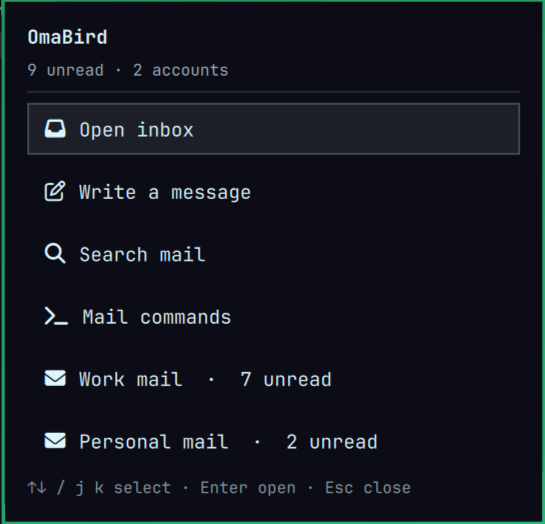

# OmaBird

Betterbird with Omarchy's current colors, desktop font and a keyboard command menu.

OmaBird 0.3 targets Betterbird **153 ESR**. It is a local customization add-on,
not a replacement mail engine. Betterbird continues to manage accounts, messages,
updates and its normal keyboard shortcuts.

## What it does

- Maps the active Omarchy palette onto the app's panes, toolbars, tabs, menus,
  settings and compose controls. Dark and light palettes are supported.
- Uses the selected Omarchy font for app controls and as the default in received
  messages. Fonts explicitly set by an email's HTML or CSS remain intact;
  the compose editor keeps its existing typography.
- Gives subjects priority over gray sender/recipient and date text in both card
  and table views. Unread subjects are brighter and bold; read mail is quieter.
  Light themes use dark text, and text colors adapt to hover/selection backgrounds
  to maintain at least 4.5:1 contrast. Native tag colors stay intact.
- Adds a searchable command menu: **Ctrl+Shift+P**, or the **OmaBird** toolbar
  button. Arrow keys select, Enter runs, Escape closes. Mail actions are disabled
  when no applicable message is selected.
- Installs an OmaBird launcher, compose launcher action and a palette-colored SVG
  icon. It does not change the default mail handler.
- Adds a native Omarchy bar mail icon with an unread badge and a brief indicator
  when unread counts increase. Left-click opens a keyboard-driven mail popup;
  right-click composes a message; middle-click opens Inbox.
- Shows unread counts by account with Inbox, Compose, Search and Commands actions.
  Arrow keys or j/k select, Enter runs, and Escape closes the popup. Colors,
  geometry and interaction use Omarchy's own bar components.
- Updates on Omarchy `theme-set` and `font-set` hooks. The add-on reads the local
  palette every 1.5 seconds and applies changes while Betterbird is open.



## Install

Requirements: Omarchy with `omarchy-theme-color` and hook support, Python 3,
Betterbird 153 ESR.

```sh
python3 omabird.py install
```

This builds `dist/omabird.xpi`, installs `~/.local/bin/omabird`, adds desktop
integration, enables the shell plugin and synchronizes the current theme. Install the XPI in Betterbird:
**Add-ons and Themes → gear menu → Install Add-on From File**.

Launch **OmaBird** from your desktop launcher, or run `omabird launch`.

```sh
omabird sync                 # Re-read current desktop colors and font
python3 omabird.py build      # Package a changed add-on
```

To update, rebuild and install the new XPI through Add-ons and Themes.

## Architecture

`omabird.py` asks Omarchy's own palette resolver for semantic colors and writes
`~/.local/state/omabird/palette.json` atomically. The theme and font hooks run
`omabird sync`. The launcher also synchronizes before opening Betterbird.

The local Thunderbird Experiment API registers a user stylesheet for app chrome,
reads palette changes, and attaches the command menu. It uses native command
controllers for message actions. No native-messaging daemon or local HTTP service
is needed. The palette is retained if a new file is invalid; all injected styles,
buttons and event listeners are removed when the add-on is disabled.

Every five seconds the mail bridge exports unread counts and account labels from
local folder metadata to `~/.local/state/omabird/mail.json`. Junk, trash and
virtual folders are excluded, including their descendants. No message subjects,
senders or bodies are exported. State directories are private (0700) and status
files are private (0600). The shell treats snapshots older than 25 seconds as
unavailable, so a closed or crashed app cannot leave a live unread badge behind.
Popup actions use a short-lived local request/response file; requests are limited
to Inbox, Search and Commands, and account keys are resolved inside Betterbird.
Compose uses Betterbird's normal command-line action.

An Experiment has unrestricted application/computer access, as stated by
Thunderbird's add-on installer. OmaBird uses it for local palette reads, app
styling and menu commands. Source is under `extension/api/implementation.js`.
It makes no network requests and does not register telemetry. Mozilla UI selectors
can change; the manifest intentionally limits installation to the tested 153 ESR
series. Message content receives only normal-priority font defaults, scoped to
mail/news URLs; app chrome rules do not apply to email HTML.

## Verification

The integration suite was run against Betterbird 153.4.0. It verifies:

- Add-on startup and the Ctrl+Shift+P shortcut.
- Marking a synthetic local message as read through the command menu.
- Folder filtering, empty results and Escape behavior.
- Live Tokyo Night, Catppuccin Latte and Vantablack palettes, including light/dark
  mode in the nested mail pane.
- Unread updates, exclusion of junk, and Inbox/Search/Commands request routing.
- Rejection of unsupported actions; closed/stale state and badge formatting.
- Invalid-palette fallback and cleanup on disable.

The new font/hierarchy checks run headlessly in an automatically created,
disposable profile without a desktop session or a listening network port:

```sh
python3 tests/ui.py
node tests/colors.cjs
node tests/model.cjs
```

They check real rendered card/table colors, read/unread weight, font defaults,
authored inline/stylesheet/legacy fonts and live font changes. The color check
covers all built-in Omarchy palettes. These checks require Betterbird and Omarchy
installed locally; the test-only instrumented XPI is never shipped.

The broader command and mail-bridge suite requires a **disposable** profile at
`.test-profile` and Marionette port 2829. It refuses to run against another profile. Never enable test automation
on your everyday mail profile.

```sh
python3 -m venv .venv
.venv/bin/pip install marionette_driver
mkdir -p .test-profile
printf 'user_pref("marionette.port", 2829);\n' > .test-profile/user.js
MOZ_DBUS_REMOTE=0 betterbird --no-remote --new-instance \
  --profile "$PWD/.test-profile" --marionette --remote-allow-system-access
# In another terminal:
python3 omabird.py build
.venv/bin/python tests/smoke.py
node tests/model.cjs
```

The tests create only synthetic local messages. Their palette and mail state is
isolated in their disposable profile using `OMABIRD_STATE_DIR`, so they do not
change your active OmaBird colors or counts. They do not switch the desktop theme.

## Publishing and licensing

OmaBird's own code is MIT-licensed; Betterbird and Omarchy remain separately
installed dependencies with their own licenses. This is an independent project.
See [the publishing guide](docs/PUBLISHING.md) for release packaging, MPL and
trademark considerations, and the Omarchy marketplace submission route.

## Remove

Disable or remove **OmaBird** in Betterbird's Add-ons and Themes.
Disable the bar widget with `omarchy plugin disable local.omabird`. Remove the
integration files if you also want to stop synchronization:

```sh
omarchy plugin remove local.omabird --yes
rm ~/.config/omarchy/hooks/theme-set.d/omabird-theme-hook
rm ~/.config/omarchy/hooks/font-set.d/omabird-theme-hook
rm ~/.local/bin/omabird
rm ~/.local/share/applications/omabird.desktop
rm ~/.local/share/icons/hicolor/scalable/apps/omabird.svg
update-desktop-database ~/.local/share/applications
```

## References

- [Omarchy](https://omarchy.org/)
- [Betterbird](https://www.betterbird.eu/)
- [Visual hierarchy principles](https://www.nngroup.com/articles/visual-design-principles/)
- [WCAG text contrast](https://www.w3.org/WAI/WCAG21/Understanding/contrast-minimum.html)
- [Thunderbird Experiment API lifecycle](https://developer.thunderbird.net/add-ons/mailextensions/experiments)
